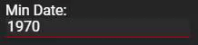
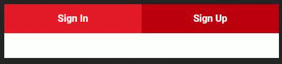
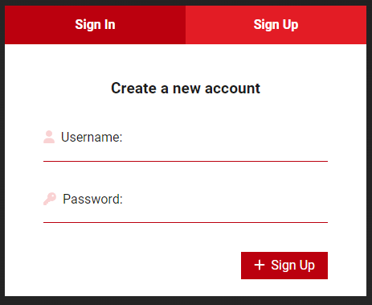
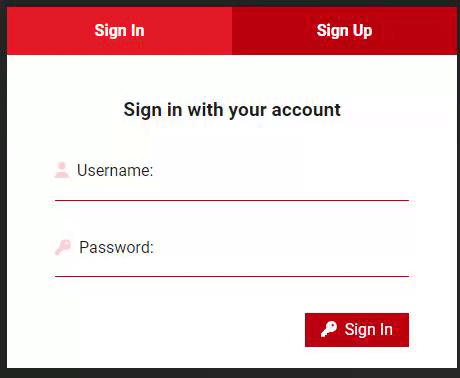

# holbertonschool-cinema-guru
In this project, we learned how to implement an app in React.

Covered Topics:
- Manage state and props in a react component
- Use React hooks to achieve certain behavior
- Implement a design with JSX and CSS (React)
- Implement a frontend app with React

**Requirements**

- Class components are not allowed
- A README.md file, at the root of the folder of the project, is mandatory
- Try to use ES6 features

**Setting up the backend**

- Installing `docker`
    - This [link](https://docs.docker.com/engine/install/ubuntu/ "link") has all the steps needed for installing docker depending on your system.
- Installing `docker-compose`
    - Official [documentation](https://docs.docker.com/compose/install/ "documentation") for installing docker-compose
- Make sure that docker is running before proceeding
- Cloning and running the backend server
    - Clone this [repository](https://github.com/atefMck/holbertonschool-cinema-guru-API "repository") on your local machine
    - `cd` into the repository folder and run the following commands:
        - `docker-compose build --no-cache --force-rm`
        - `docker-compose up`
        - After running the above command you should get an output similar to this indicating that the backend and db are running. 

**Notes**

- You’ll be adding the base url before each API route mentioned in the tasks: `http://localhost:8000/`
- The [repository](https://github.com/atefMck/holbertonschool-cinema-guru-API "repository") contains detailed information about each route in the API
- The React and friends versions to use :
    - “react-dom”: “^17.0.2”
    - “react-router-dom”: “^6.2.2”
    - “react-scripts”: “5.0.0”

**Table of Contents**
- [0. Cloning the Figma project](#0-cloning-the-figma-project)
- [1. Setting up the workspace](#1-setting-up-the-workspace)
- [2. Adding the general use components](#2-adding-the-general-use-components)
- [3. Initialize the main App component](#3-initialize-the-main-app-component)
- [4. Authentification - Component behavior](#4-authentification---component-behavior)
- [5. Authentification - Api integration](#5-authentification---api-integration)
- [6. Navigation - Adding the header](#6-navigation---adding-the-header)
- [7. Navigation - Sidebar](#7-navigation---sidebar)
- [8. Dashboard routing](#8-dashboard-routing)

## 0. Cloning the Figma project
Create an account in [Figma](https://www.figma.com/ "Figma") if you don’t have one and open [this project](https://www.figma.com/design/RPc247kHDXz5QeFNUM3Gs6/Holbertonschool---Cinema-Guru?node-id=0-1&node-type=canvas "this project") and “Duplicate to your Drafts” to have access to all design details.

If you can’t access it, please find here the [Figma file](readme_assets/cinemaGuru.fig "Figma file").

**_All the components designs that we will be working on could be found in the Figma file._**

[Return to Top](#holbertonschool-cinema-guru)

## 1. Setting up the workspace
In this project, we will use the `yarn` package manager instead of npm.
- Using `yarn create` create your React app.
- Remove all the unnecessary files and their respective imports. `src/App.test.js`,`src/reportWebVitals.js`, `src/setupTests.js`, `src/logo.svg`
- Make sure your App component returns an empty `div` with `className="App"`

**Packages**

This is the list of packages we will need throughout this project:
- `@fortawesome/fontawesome-svg-core 6.1.0`
- `@fortawesome/free-solid-svg-icons 6.1.0`
- `@fortawesome/react-fontawesome 0.1.18`
- `axios 0.26.1`
- `lodash 4.17.21`
- `normalize.css 8.0.1`

Install them and make sure they’re added as dependencies.

**Project Structure**

This will be the general folder structuring.
- `public/`
- `src/`
    - `assets/`
    - `components/`
    - `routes/`

**_Make sure all your source files are under the repository root and not under a subdirectory._**

**Repo:**
- File: `README.md, package.json, public/, src/assets/, src/components, src/routes, src/App.js`

[Return to Top](#holbertonschool-cinema-guru)

## 2. Adding the general use components
In this task we will add various general components that we will be using almost in every major component.

**Input**

Create `src/components/general/Input.js`:

- The file should import `general.css`
- The file should export a functional component named `Input` as default:
    - Input must accept these props:
        - `label`: String – The input label
        - `type`: String – Input type
        - `className`: String – Input custom classes
        - `value`: Any – The controlled state
        - `setValue`: Function – The setState function of the above state.
        - `icon`(optional): FontAwesomeIcon – An icon to decorate the input with.
        - `inputAttributes`(optional): Object – Other input attributes
- Input’s return value must contain a html input with the appropriate attributes from the props.
- Create `handleInput` function that takes the `onChange` event as parameter and sets the value to the event target value using the `setValue` prop and pass it to the input `onChange` event.

**SelectInput**

Create `src/components/general/SelectInput.js`:

- The file should import `general.css`
- The file should export a functional component named `SelectInput` as default:
    - SelectInput must accept these props:
        - `label`: String – The input label
        - `options`: Array – Array of select options
        - `className`: String – SelectInput custom classes
        - `value`: Any – The controlled state
        - `setValue`: Function – The setState function of the above state.
- SelectInput’s return value must contain a html select tag with the appropriate attributes from the props.
    - Inside the select tag, map each option from the options prop to return an option tag with the appropriate attributes and text inside.
- Create `handleSelect` function that takes the `onChange` event as parameter and sets the value to the event target value using the `setValue` prop and pass it to the select `onChange` event.

**Button**

Create `src/components/general/Button.js`:

- The file should import `general.css`
- The file should export a functional component named `Button` as default:
    - Button must accept these props:
        - `label`: String – The button label
        - `className`: String – Button custom classes
        - `onClick`: Function – The onClick handler for the button.
        - `icon`(optional): FontAwesomeIcon – An icon to decorate the button with.
- Button’s return value must contain a html button tag with the appropriate attributes from the props.
    - Inside the button tag, there should be a FontAwesomeIcon if provided and the button text.
- Bind the button `onClick` event with the `onClick` function passed from the props.

**SearchBar**

Create `src/components/general/SearchBar.js`:

- The file should import `general.css`
- The file should export a functional component named `SearchBar` as default:
    - Button must accept these props:
        - `title`: String – The controlled state
        - `setTitle`: String – The setState function of the above state.
- SearchBar’s return value must contain a html input with the appropriate attributes from the props.
- Create `handleInput` function that takes the `onChange` event as parameter and sets the value to the event target value using the `setTitle` prop and pass it to the input `onChange` event.

**general.css**

Create `src/components/general/general.css`:

- Add the necessary css rules to assure the components design provided in Figma.

[Return to Top](#holbertonschool-cinema-guru)

## 3. Initialize the main App component
Now we will add the main App comonent that will host all of the others.

**App**

Edit `src/App.js`:
- The file should import `App.css`
- The file should export a functional component named `App` as default:
    - Add the following state to the component using the `useState` hook:
        - `isLoggedIn`Boolean default: `false`
        - `userUsername`string default: `""`
    - use the `useEffect` hook to do the following whenever the component mounts:
        - Get the value of `accessToken` item from the `localStorage`
        - Send a post request to `/api/auth/` with the `authorization` header set to `Bearer <accessToken>`
            - `onSuccess` set the isLoggedin and the userUsername state to true and the username from the response object respectively
    - App must return depending on the isLoggedIn state :
        - `true`: The Dashboard component (Will be built in later tasks)
        - `false`: The Authentication component (Will be built in later tasks)

[Return to Top](#holbertonschool-cinema-guru)

## 4. Authentification - Component behavior
In this task we will add the three main authentication components `Authentication Login Register`

**auth.css**

Create `src/routes/auth/auth.css`:

This file would host all the css needed for the authentication components.

**Authentication**

The `Authentication` component will be the parent of the two other mentioned component. It will allow us to switch between logging in or registering when clicking the header buttons.

Create `src/routes/auth/Authentication.js`:
- The file should import `auth.css`
- The file should export a functional component named `Authentication` as default:
    - Authentication must accept these props:
        - `setIsLoggedIn`: function – The setState for the isLoggedin state
        - `setUserUsername`: function –The setState for the userUsername state
    - Add the following state to the component using the `useState` hook:
        - `_switch`Boolean default: `true`
        - `username`string default: `""`
        - `password`string default: `""`
    - Authentication must return a html `form` in which there’s two `Buttons`:
        - Sign In: When clicked sets the `_switch` state to `true`
        - Sign Up: When clicked sets the `_switch` state to `false`

**Login**

The `Login` will host the components needed to login.

Create `src/routes/auth/Login.js`:
- The file should import `auth.css`
- The file should export a functional component named `Login` as default:
    - Login must accept these props:
        - `username`: string – The username controlled state
        - `password`: string – The password controlled state
        - `setUsername`: function – The setState for the username state
        - `setPassword`: function –The setState for the password state
    - Login must return:
        - Two Inputs for the username and password
        - A Button for submit

**Register**

The `Register` will host the components needed to register.

Create `src/routes/auth/Register.js`:
- The file should import `auth.css`
- The file should export a functional component named `Register` as default:
    - Authentication must accept these props:
        - `username`: string – The username controlled state
        - `password`: string – The password controlled state
        - `setUsername`: function – The setState for the username state
        - `setPassword`: function –The setState for the password state
    - Register must return:
        - Two Inputs for the username and password
        - A Button for submit

In `src/routes/auth/Authentication.js`:
- import `Login` and `Register`
- Add the necessary code to render the `Login` component whenever `_switch` is `true` otherwise render `Register`

[Return to Top](#holbertonschool-cinema-guru)

## 5. Authentification - Api integration
In this task, will add the necessary logic to finalize the authentication process.

- in `src/routes/auth/Authentication.js`:
    - Create `handleSubmit` function:
        - handleSubmit takes the `onSubmit` event as parameter.
        - use the `preventDefault` event method to disable the default behavior of the form
        - Depending on the _switch state:
            - `true`: using `axios` send a post request to `/api/auth/login` route with `username` and `password` from the component state as body data.
            - `false`: using `axios` send a post request to `/api/auth/register` route with `username` and `password` from the component state as body data.
            - `onSuccess` we will get a response containing a jwt access token.
                - Store the token in the `localStorage`
                - Set the userUsername state to username
                - Set the isLoggedIn state to true
    - Bind the `handleSubmit` function to the form `onSubmit` event

[Return to Top](#holbertonschool-cinema-guru)

## 6. Navigation - Adding the header
In this task we will start building the Dashboard component.

**dashboard.css**

Create `src/routes/dashboard/dashboard.css`:

This file would host all the css needed for the dashboard components.

**navigation.css**

Create `src/components/navigation/navigation.css`:

This file would host all the css needed for the navigation components.

**Header**

Create `src/components/navigation/Header.js`:
- The file should import `navigation.css`
- The file should export a functional component named `Header` as default:
    - Header must accept these props:
        - `userUsername`: string – The state for the username
        - `setIsLoggedIn`: function –The setState for the isLoggedin state
    - Header must return a html `nav` containing these elements and others:
        - `img`: `src="https://picsum.photos/100/100"` for random avatars
        - `p`: Welcoming the user using the `userUsername` state
        - `span`: with an icon and logout text
    - Create `logout` function in which:
        - Remove the `accessToken` item from `localStorage`
        - Set isLoggedIn state to false
    - Bind the `logout` function the the logout span’s `onClick` event.

**Dashboard**

Create `src/routes/dashboard/Dashboard.js`:
- The file should import `dashboard.css`
- The file should import the Header component
- The file should export a functional component named `Dashboard` as default:
    - Dashboard must accept these props:
        - `userUsername`: string – The state for the username
        - `setIsLoggedIn`: function –The setState for the isLoggedin state
    - Dashboard must return a html `div` containing these elements and others:
        - Add the Header component to Dashboard return value passing to it the `userUsername` and `setIsLoggedIn` as props

[Return to Top](#holbertonschool-cinema-guru)

## 7. Navigation - Sidebar
In this task we will add another component to facilitate navigating through the app even more

**auth.css**

Create `src/components/components.css`:

This file would host all the css needed for miscellaneous components.

**Activity**

The `Activity` component will help us show the recent activities.

Create `src/components/Activity.js`:
- The file should import `components.css`
- The file should export a functional component named `Activity` as default:
    - Activity must return a html `li` containing these elements and others:
        - `p`: Formatted sentence according to the activity (see design)

**SideBar**

The `SideBar` component will be a key component for better navigation.

Create `src/components/navigation/SideBar.js`:

- The file should import `navigation.css`
- The file should export a functional component named `SideBar` as default:
    - Add the following state to the component using the `useState` hook:
        - `selected`string default: `"home"`
        - `small`boolean default: `true`
        - `activities`array default: `[]`
        - `showActivities`boolean default: `false`
    - Create `setPage` function:
        - `setPage` takes one parameter `pageName`
        - `setPage` sets the `selected` state to `pageName`
        - using the `useNavigate` hook, redirect the user to the desired page
            - “Home” =&gt; `/home`
            - “Favorites” =&gt; `/favorites`
            - “Watch Later” =&gt; `/watchlater`
    - Using the `useEffect` hook:
        - Send a get request using axios to `/api/activity`. on Success set the activities state to the response data.
    - Authentication must return a html `nav` containing these elements and others:
        - Navigation `ul`:
            - Contains three `li` with an icon corresponding to the design and the following text `"Home"` `"Favorites"` `"Watch Later"`, then bind the li’s onClick event to `setPage` function passing the corresponding `pageName`
        - Activity `ul`:
            - Map the first 10 values from the activities state to the Activity component.

In `src/routes/dashboard/Dashboard.js`:

- Import the SideBar component and style it according to the design

[Return to Top](#holbertonschool-cinema-guru)

## 8. Dashboard routing
Now we’ll add the routing.

**Dashboard**

Edit `src/routes/dashboard/Dashboard.js`:
- Import `BrowserRouter`, `Routes`, `Route`, `Navigate` from `react-router-dom`
- Wrap the return value of the Dashboard component in a `BrowserRouter`
- Add a Routes component. Inside it add:
    - `Route` to path `/home` that should render the `HomePage` component (Will be created in a later task)
    - `Route` to path `/favorites` that should render the `Favorites` component (Will be created in a later task)
    - `Route` to path `/watchlater` that should render the `WhatchLater` component (Will be created in a later task)
    - `Route` for all other paths that redirects the user to `/home` using the `Navigate` component

[Return to Top](#holbertonschool-cinema-guru)
