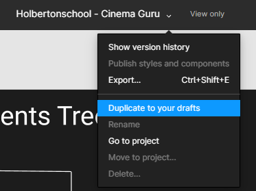
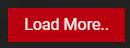

# holbertonschool-cinema-guru
In this project, we learned how to implement an app in React.

Covered Topics:
- Manage state and props in a react component
- Use React hooks to achieve certain behavior
- Implement a design with JSX and CSS (React)
- Implement a frontend app with React

**Requirements**

- Class components are not allowed
- A README.md file, at the root of the folder of the project, is mandatory
- Try to use ES6 features

**Setting up the backend**

- Installing `docker`
    - This [link](https://docs.docker.com/engine/install/ubuntu/ "link") has all the steps needed for installing docker depending on your system.
- Installing `docker-compose`
    - Official [documentation](https://docs.docker.com/compose/install/ "documentation") for installing docker-compose
- Make sure that docker is running before proceeding
- Cloning and running the backend server
    - Clone this [repository](https://github.com/atefMck/holbertonschool-cinema-guru-API "repository") on your local machine
    - `cd` into the repository folder and run the following commands:
        - `docker-compose build --no-cache --force-rm`
        - `docker-compose up`
        - After running the above command you should get an output similar to this indicating that the backend and db are running. 

**Notes**

- You’ll be adding the base url before each API route mentioned in the tasks: `http://localhost:8000/`
- The [repository](https://github.com/atefMck/holbertonschool-cinema-guru-API "repository") contains detailed information about each route in the API
- The React and friends versions to use :
    - “react-dom”: “^17.0.2”
    - “react-router-dom”: “^6.2.2”
    - “react-scripts”: “5.0.0”

**Table of Contents**
- [0. Cloning the Figma project](#0-cloning-the-figma-project)
- [1. Setting up the workspace](#1-setting-up-the-workspace)
- [2. Adding the general use components](#2-adding-the-general-use-components)
- [3. Initialize the main App component](#3-initialize-the-main-app-component)

## 0. Cloning the Figma project
Create an account in [Figma](https://www.figma.com/ "Figma") if you don’t have one and open [this project](https://www.figma.com/design/RPc247kHDXz5QeFNUM3Gs6/Holbertonschool---Cinema-Guru?node-id=0-1&node-type=canvas "this project") and “Duplicate to your Drafts” to have access to all design details.

If you can’t access it, please find here the [Figma file](readme_assets/cinemaGuru.fig "Figma file").

**_All the components designs that we will be working on could be found in the Figma file._**

[Return to Top](#holbertonschool-cinema-guru)

## 1. Setting up the workspace
In this project, we will use the `yarn` package manager instead of npm.
- Using `yarn create` create your React app.
- Remove all the unnecessary files and their respective imports. `src/App.test.js`,`src/reportWebVitals.js`, `src/setupTests.js`, `src/logo.svg`
- Make sure your App component returns an empty `div` with `className="App"`

**Packages**

This is the list of packages we will need throughout this project:
- `@fortawesome/fontawesome-svg-core 6.1.0`
- `@fortawesome/free-solid-svg-icons 6.1.0`
- `@fortawesome/react-fontawesome 0.1.18`
- `axios 0.26.1`
- `lodash 4.17.21`
- `normalize.css 8.0.1`

Install them and make sure they’re added as dependencies.

**Project Structure**

This will be the general folder structuring.
- `public/`
- `src/`
    - `assets/`
    - `components/`
    - `routes/`

**_Make sure all your source files are under the repository root and not under a subdirectory._**

**Repo:**
- File: `README.md, package.json, public/, src/assets/, src/components, src/routes, src/App.js`

[Return to Top](#holbertonschool-cinema-guru)

## 2. Adding the general use components
In this task we will add various general components that we will be using almost in every major component.

**Input**

Create `src/components/general/Input.js`:

- The file should import `general.css`
- The file should export a functional component named `Input` as default:
    - Input must accept these props:
        - `label`: String – The input label
        - `type`: String – Input type
        - `className`: String – Input custom classes
        - `value`: Any – The controlled state
        - `setValue`: Function – The setState function of the above state.
        - `icon`(optional): FontAwesomeIcon – An icon to decorate the input with.
        - `inputAttributes`(optional): Object – Other input attributes
- Input’s return value must contain a html input with the appropriate attributes from the props.
- Create `handleInput` function that takes the `onChange` event as parameter and sets the value to the event target value using the `setValue` prop and pass it to the input `onChange` event.

**SelectInput**

Create `src/components/general/SelectInput.js`:

- The file should import `general.css`
- The file should export a functional component named `SelectInput` as default:
    - SelectInput must accept these props:
        - `label`: String – The input label
        - `options`: Array – Array of select options
        - `className`: String – SelectInput custom classes
        - `value`: Any – The controlled state
        - `setValue`: Function – The setState function of the above state.
- SelectInput’s return value must contain a html select tag with the appropriate attributes from the props.
    - Inside the select tag, map each option from the options prop to return an option tag with the appropriate attributes and text inside.
- Create `handleSelect` function that takes the `onChange` event as parameter and sets the value to the event target value using the `setValue` prop and pass it to the select `onChange` event.

**Button**

Create `src/components/general/Button.js`:

- The file should import `general.css`
- The file should export a functional component named `Button` as default:
    - Button must accept these props:
        - `label`: String – The button label
        - `className`: String – Button custom classes
        - `onClick`: Function – The onClick handler for the button.
        - `icon`(optional): FontAwesomeIcon – An icon to decorate the button with.
- Button’s return value must contain a html button tag with the appropriate attributes from the props.
    - Inside the button tag, there should be a FontAwesomeIcon if provided and the button text.
- Bind the button `onClick` event with the `onClick` function passed from the props.

**SearchBar**

Create `src/components/general/SearchBar.js`:

- The file should import `general.css`
- The file should export a functional component named `SearchBar` as default:
    - Button must accept these props:
        - `title`: String – The controlled state
        - `setTitle`: String – The setState function of the above state.
- SearchBar’s return value must contain a html input with the appropriate attributes from the props.
- Create `handleInput` function that takes the `onChange` event as parameter and sets the value to the event target value using the `setTitle` prop and pass it to the input `onChange` event.

**general.css**

Create `src/components/general/general.css`:

- Add the necessary css rules to assure the components design provided in Figma.

[Return to Top](#holbertonschool-cinema-guru)

## 3. Initialize the main App component
Now we will add the main App comonent that will host all of the others.

**App**

Edit `src/App.js`:
- The file should import `App.css`
- The file should export a functional component named `App` as default:
    - Add the following state to the component using the `useState` hook:
        - `isLoggedIn`Boolean default: `false`
        - `userUsername`string default: `""`
    - use the `useEffect` hook to do the following whenever the component mounts:
        - Get the value of `accessToken` item from the `localStorage`
        - Send a post request to `/api/auth/` with the `authorization` header set to `Bearer <accessToken>`
            - `onSuccess` set the isLoggedin and the userUsername state to true and the username from the response object respectively
    - App must return depending on the isLoggedIn state :
        - `true`: The Dashboard component (Will be built in later tasks)
        - `false`: The Authentication component (Will be built in later tasks)

[Return to Top](#holbertonschool-cinema-guru)
